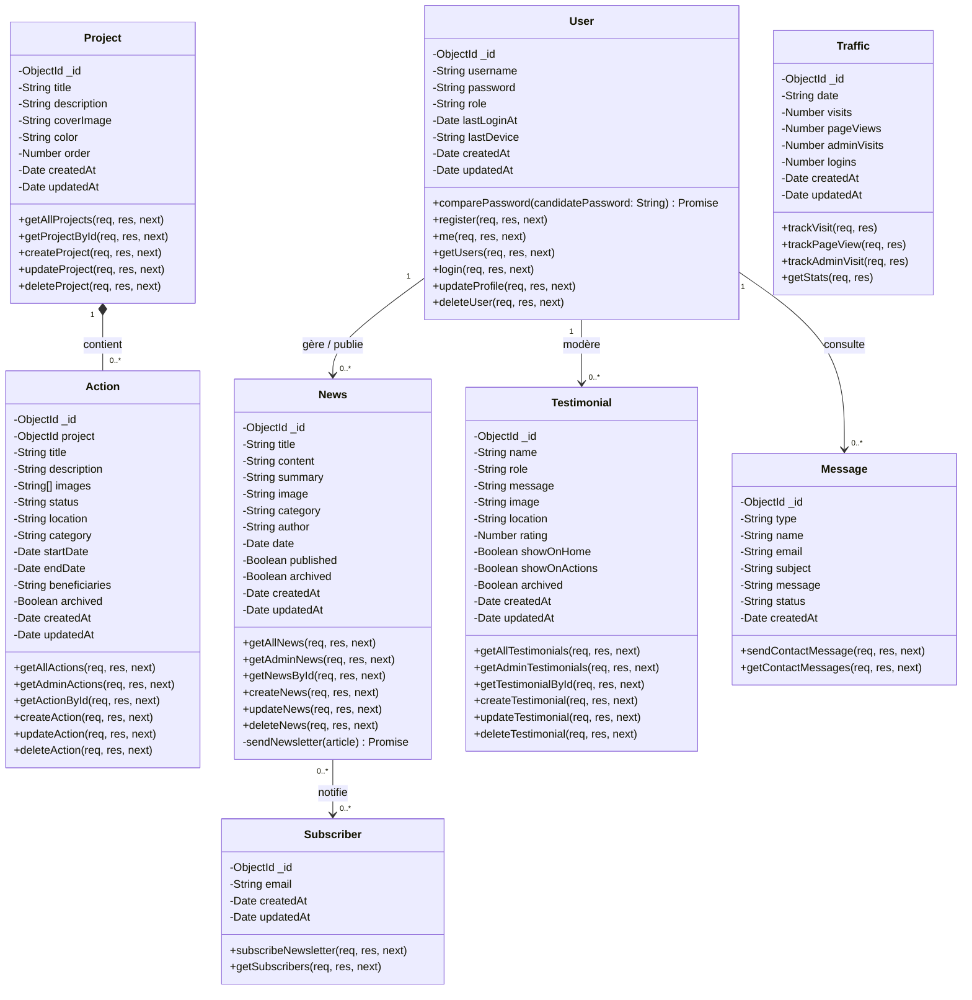

# Description Complète du Diagramme de Classes - Projet Bussola

Ce document présente une description détaillée des classes, de leurs attributs (avec types et contraintes) et de leurs méthodes (au niveau des modèles Mongoose et des contrôleurs API) au sein du projet **Bussola**.

> [!NOTE]
> **Légende des visibilités UML utilisées dans ce document :**
> *   `+` (Public) : L'élément est accessible depuis l'extérieur de la classe (ex. les routes API publiques et les contrôleurs).
> *   `-` (Privé) : L'élément est encapsulé et accessible uniquement au sein de la classe (ex. les attributs de base de données et les fonctions utilitaires internes).

---

## 1. Diagramme de Classes (Mermaid)

Voici la représentation visuelle du diagramme de classes au format Mermaid.js avec les visibilités UML correctes :

---

## 2. Description Détaillée des Classes

### 2.1. Classe `User` (Administrateur)
Cette classe gère les comptes administrateurs de la plateforme qui disposent de droits d'accès sécurisés (JWT) pour administrer le back-office.

#### Attributs :
| Visibilité | Attribut | Type | Contraintes | Description |
| :--- | :--- | :--- | :--- | :--- |
| `-` | `_id` | `ObjectId` | Auto-généré, Unique | Identifiant unique MongoDB du compte. |
| `-` | `username` | `String` | Requis, Unique, Trim | Nom d'utilisateur unique de connexion. |
| `-` | `password` | `String` | Requis | Mot de passe sécurisé et haché. |
| `-` | `role` | `String` | Enum: `['admin']`, Default: `'admin'` | Rôle de l'utilisateur au sein du système. |
| `-` | `lastLoginAt` | `Date` | Optionnel | Horodatage de la dernière connexion réussie. |
| `-` | `lastDevice` | `String` | Optionnel | Agent utilisateur (User-Agent) utilisé lors de la dernière connexion. |
| `-` | `createdAt` | `Date` | Auto-généré | Date de création du profil. |
| `-` | `updatedAt` | `Date` | Auto-généré | Date de dernière mise à jour. |

#### Méthodes et Opérations :
*   **Méthodes Internes (Modèle User.js) :**
    *   `- pre("save")` : Hache automatiquement le mot de passe via `bcrypt` (facteur de coût 10) avant l'insertion ou la mise à jour en BDD s'il a été modifié.
    *   `+ comparePassword(candidatePassword)` : Compare le mot de passe fourni en clair avec le mot de passe haché de la base de données.
*   **Opérations de Contrôleur (authController.js) :**
    *   `+ register(req, res)` : Crée un nouvel administrateur après validation d'un mot de passe maître (`masterPassword`) configuré sur le serveur.
    *   `+ login(req, res)` : Authentifie l'administrateur, met à jour `lastLoginAt` et `lastDevice`, génère un jeton JWT de 24h, et incrémente le compteur de connexions de trafic du jour.
    *   `+ me(req, res)` : Retourne les informations de l'administrateur actuellement authentifié par son token.
    *   `+ getUsers(req, res)` : Récupère la liste de tous les utilisateurs (sans exposer leurs mots de passe).
    *   `+ updateProfile(req, res)` : Met à jour le mot de passe de l'administrateur connecté après vérification de son mot de passe actuel.
    *   `+ deleteUser(req, res)` : Supprime un compte administrateur (avec protection interdisant l'auto-suppression).

---

### 2.2. Classe `Project` (Piliers Stratégiques)
Représente les axes d'intervention clés de l'ONG (ex: Santé sexuelle et reproductive, Consolidation de la paix, Leadership féminin).

#### Attributs :
| Visibilité | Attribut | Type | Contraintes | Description |
| :--- | :--- | :--- | :--- | :--- |
| `-` | `_id` | `ObjectId` | Auto-généré, Unique | Identifiant unique MongoDB. |
| `-` | `title` | `String` | Requis, Unique, Trim | Titre ou libellé du projet/pilier. |
| `-` | `description` | `String` | Requis | Présentation détaillée du projet. |
| `-` | `coverImage` | `String` | Requis | URL ou Base64 de la photo de couverture. |
| `-` | `color` | `String` | Default: `'#3498db'` | Couleur Hexadécimale associée dans l'interface web. |
| `-` | `order` | `Number` | Default: `0` | Ordre d'affichage de tri dans l'application. |
| `-` | `createdAt` | `Date` | Auto-généré | Date d'enregistrement. |
| `-` | `updatedAt` | `Date` | Auto-généré | Date de modification. |

#### Opérations de Contrôleur (projectController.js) :
*   `+ getAllProjects(req, res)` : Liste tous les projets triés par le champ `order` (ascendant) puis par `createdAt` (descendant).
*   `+ getProjectById(req, res)` : Récupère les détails complets d'un projet spécifique par son identifiant.
*   `+ createProject(req, res)` : Enregistre un nouveau projet (Admin uniquement).
*   `+ updateProject(req, res)` : Modifie les informations d'un projet existant (Admin uniquement).
*   `+ deleteProject(req, res)` : Supprime définitivement un projet de la base de données (Admin uniquement).

---

### 2.3. Classe `Action` (Activités Terrain)
Représente les activités de terrain concrètes réalisées par l'ONG, obligatoirement rattachées à un projet parent.

#### Attributs :
| Visibilité | Attribut | Type | Contraintes | Description |
| :--- | :--- | :--- | :--- | :--- |
| `-` | `_id` | `ObjectId` | Auto-généré, Unique | Identifiant unique MongoDB. |
| `-` | `project` | `ObjectId` | Requis, Clé Étrangère | Identifiant du projet (`Project`) auquel l'action est liée. |
| `-` | `title` | `String` | Requis, Trim | Titre descriptif de l'action. |
| `-` | `description` | `String` | Requis | Compte rendu et description de l'activité. |
| `-` | `images` | `Array<String>` | Optionnel | Collection d'URLs/Base64 pour illustrer l'activité. |
| `-` | `status` | `String` | Enum: `['En attente', 'En cours', 'Terminé']`, Default: `'En cours'` | État d'avancement de l'action. |
| `-` | `location` | `String` | Requis | Ville, région ou pays de l'activité. |
| `-` | `category` | `String` | Enum: `['Santé', 'Éducation', 'Droit', 'Social', 'Environnement']`, Requis | Domaine sectoriel de l'action. |
| `-` | `startDate` | `Date` | Optionnel | Date de début de l'action. |
| `-` | `endDate` | `Date` | Optionnel | Date de fin de l'action. |
| `-` | `beneficiaries` | `String` | Optionnel | Description textuelle du nombre et du type de bénéficiaires. |
| `-` | `archived` | `Boolean` | Default: `false` | Cache l'action aux utilisateurs publics si positionné à `true`. |
| `-` | `createdAt` | `Date` | Auto-généré | Date de création de l'action. |
| `-` | `updatedAt` | `Date` | Auto-généré | Date de dernière modification. |

#### Opérations de Contrôleur (actionController.js) :
*   `+ getAllActions(req, res)` : Liste les actions non archivées pour l'affichage public, triées par date décroissante.
*   `+ getAdminActions(req, res)` : Liste l'ensemble des actions, archivées ou non, pour l'interface administrative.
*   `+ getActionById(req, res)` : Récupère une action spécifique par son ID.
*   `+ createAction(req, res)` : Crée et associe une action à un projet (Admin uniquement).
*   `+ updateAction(req, res)` : Met à jour les informations d'une action (Admin uniquement).
*   `+ deleteAction(req, res)` : Supprime une action (Admin uniquement).

---

### 2.4. Classe `News` (Actualités et Publications)
Modélise les communiqués et articles d'actualités rédigés par l'ONG pour son site web.

#### Attributs :
| Visibilité | Attribut | Type | Contraintes | Description |
| :--- | :--- | :--- | :--- | :--- |
| `-` | `_id` | `ObjectId` | Auto-généré, Unique | Identifiant unique MongoDB. |
| `-` | `title` | `String` | Requis, Trim | Titre de l'article de presse. |
| `-` | `content` | `String` | Requis | Corps du texte ou contenu de l'actualité. |
| `-` | `summary` | `String` | Optionnel | Résumé d'accroche pour la page d'actualités. |
| `-` | `image` | `String` | Optionnel | Image de couverture (URL ou Base64). |
| `-` | `category` | `String` | Enum: `['Action', 'Événement', 'Partenariat', 'Information']`, Default: `'Information'` | Classification de l'actualité. |
| `-` | `author` | `String` | Default: `'Équipe Busola'` | Auteur de l'article de presse. |
| `-` | `date` | `Date` | Default: `Date.now` | Date de publication de l'article. |
| `-` | `published` | `Boolean` | Default: `true` | Statut de publication en ligne. |
| `-` | `archived` | `Boolean` | Default: `false` | Statut d'archivage (cache l'article). |
| `-` | `createdAt` | `Date` | Auto-généré | Date de création de l'article. |
| `-` | `updatedAt` | `Date` | Auto-généré | Date de dernière modification. |

#### Opérations de Contrôleur (newsController.js) :
*   `+ getAllNews(req, res)` : Récupère les actualités publiées et non archivées (Public).
*   `+ getAdminNews(req, res)` : Récupère l'ensemble des actualités pour l'administration (Admin).
*   `+ getNewsById(req, res)` : Récupère un article d'actualité individuel par son ID.
*   `+ createNews(req, res)` : Crée un article. *Si l'article est marqué comme publié, cela déclenche automatiquement l'envoi de la newsletter.*
*   `+ updateNews(req, res)` : Met à jour une actualité. *Si l'article passe de l'état "non publié" à "publié", l'envoi de la newsletter est automatiquement déclenché.*
*   `+ deleteNews(req, res)` : Supprime définitivement l'article (Admin uniquement).
*   `- sendNewsletter(article)` : *Méthode utilitaire interne (privée)* asynchrone qui récupère tous les abonnés de la newsletter et déclenche l'envoi groupé par Nodemailer.

---

### 2.5. Classe `Subscriber` (Abonnés Newsletter)
Stocke les e-mails des utilisateurs abonnés pour recevoir les actualités de l'ONG.

#### Attributs :
| Visibilité | Attribut | Type | Contraintes | Description |
| :--- | :--- | :--- | :--- | :--- |
| `-` | `_id` | `ObjectId` | Auto-généré, Unique | Identifiant unique. |
| `-` | `email` | `String` | Requis, Unique, Lowercase, Trim | Adresse email valide abonnée à la liste. |
| `-` | `createdAt` | `Date` | Auto-généré | Date d'abonnement. |
| `-` | `updatedAt` | `Date` | Auto-généré | Date de modification. |

#### Opérations de Contrôleur (formController.js) :
*   `+ subscribeNewsletter(req, res)` : Inscrit un nouvel e-mail s'il n'existe pas déjà dans la base.
*   `+ getSubscribers(req, res)` : Récupère la liste de tous les abonnés (Admin uniquement).

---

### 2.6. Classe `Testimonial` (Témoignages / Impact)
Représente les avis et retours d'expérience soumis par les partenaires et les bénéficiaires de l'ONG.

#### Attributs :
| Visibilité | Attribut | Type | Contraintes | Description |
| :--- | :--- | :--- | :--- | :--- |
| `-` | `_id` | `ObjectId` | Auto-généré, Unique | Identifiant unique MongoDB. |
| `-` | `name` | `String` | Requis, Trim | Nom de l'auteur du témoignage. |
| `-` | `role` | `String` | Requis, Trim | Statut ou titre de la personne (ex: "Bénéficiaire"). |
| `-` | `message` | `String` | Requis | Corps du témoignage / Avis. |
| `-` | `image` | `String` | Optionnel | URL ou Base64 de la photo de profil de l'auteur. |
| `-` | `location` | `String` | Optionnel, Trim | Provenance géographique de l'auteur. |
| `-` | `rating` | `Number` | Min: 1, Max: 5, Default: 5 | Note sur 5 étoiles de l'action / impact. |
| `-` | `showOnHome` | `Boolean` | Default: `true` | Autorise l'affichage sur la page d'accueil de l'application. |
| `-` | `showOnActions` | `Boolean` | Default: `false` | Autorise l'affichage sur la page des actions. |
| `-` | `archived` | `Boolean` | Default: `false` | Masque le témoignage si positionné à `true`. |
| `-` | `createdAt` | `Date` | Auto-généré | Date d'enregistrement. |
| `-` | `updatedAt` | `Date` | Auto-généré | Date de modification. |

#### Opérations de Contrôleur (testimonialController.js) :
*   `+ getAllTestimonials(req, res)` : Liste les témoignages publics non archivés (Public).
*   `+ getAdminTestimonials(req, res)` : Liste l'ensemble des témoignages pour gestion administrative (Admin).
*   `+ getTestimonialById(req, res)` : Récupère un témoignage par son identifiant unique.
*   `+ createTestimonial(req, res)` : Soumet un témoignage par le public (en attente de modération).
*   `+ updateTestimonial(req, res)` : Permet de modérer, de valider l'affichage ou d'éditer un témoignage (Admin uniquement).
*   `+ deleteTestimonial(req, res)` : Supprime un témoignage de la base de données (Admin uniquement).

---

### 2.7. Classe `Message` (Messages de Contact)
Représente les requêtes formulées via les formulaires de contact, de demande de partenariat ou de bénévolat.

#### Attributs :
| Visibilité | Attribut | Type | Contraintes | Description |
| :--- | :--- | :--- | :--- | :--- |
| `-` | `_id` | `ObjectId` | Auto-généré, Unique | Identifiant unique MongoDB. |
| `-` | `type` | `String` | Enum: `['partenariat', 'benevolat', 'contact']`, Requis | Type ou nature du message soumis. |
| `-` | `name` | `String` | Requis | Nom complet de l'émetteur. |
| `-` | `email` | `String` | Requis, Lowercase | Adresse email de contact de l'émetteur. |
| `-` | `subject` | `String` | Optionnel | Sujet du message. |
| `-` | `message` | `String` | Requis | Message textuel de la demande. |
| `-` | `status` | `String` | Enum: `['nouveau', 'lu', 'traité']`, Default: `'nouveau'` | État d'avancement du traitement du message. |
| `-` | `createdAt` | `Date` | Default: `Date.now` | Date de soumission du formulaire. |

#### Opérations de Contrôleur (formController.js) :
*   `+ sendContactMessage(req, res)` : Reçoit, valide et enregistre le message public, puis déclenche un e-mail de notification automatique à l'administrateur.
*   `+ getContactMessages(req, res)` : Liste tous les messages reçus pour l'administration (Admin uniquement).

---

### 2.8. Classe `Traffic` (Analytique)
Permet de collecter et suivre les indicateurs journaliers de trafic pour l'administration de l'ONG.

#### Attributs :
| Visibilité | Attribut | Type | Contraintes | Description |
| :--- | :--- | :--- | :--- | :--- |
| `-` | `_id` | `ObjectId` | Auto-généré, Unique | Identifiant unique MongoDB. |
| `-` | `date` | `String` | Requis, Unique (format `YYYY-MM-DD`) | Date du jour concerné par les statistiques. |
| `-` | `visits` | `Number` | Default: `0` | Compte des visites uniques par jour (une par session). |
| `-` | `pageViews` | `Number` | Default: `0` | Compte global des vues de pages sur le site. |
| `-` | `adminVisits` | `Number` | Default: `0` | Compte d'activités provenant d'utilisateurs authentifiés Admin. |
| `-` | `logins` | `Number` | Default: `0` | Nombre de connexions administrateurs validées. |
| `-` | `createdAt` | `Date` | Auto-généré | Date de création de la statistique journalière. |
| `-` | `updatedAt` | `Date` | Auto-généré | Date de dernière mise à jour. |

#### Opérations de Contrôleur (trafficController.js) :
*   `+ trackVisit(req, res)` : Incrémente de 1 le nombre de visites uniques de la journée.
*   `+ trackPageView(req, res)` : Incrémente de 1 le nombre de pages vues globales de la journée.
*   `+ trackAdminVisit(req, res)` : Incrémente de 1 les requêtes effectuées par l'administration.
*   `+ getStats(req, res)` : Extrait l'historique des statistiques de trafic sur les 30 derniers jours (Admin uniquement).

---

## 3. Description des Relations

### 3.1. Relation : `Project` &harr; `Action`
*   **Type :** Composition logique ou Association forte.
*   **Multiplicité :** Un projet (`Project`) englobe **0 à plusieurs** (`0..*`) actions (`Action`). Une action appartient de manière stricte à **1 et 1 seul** (`1`) projet.

### 3.2. Relation : `User` &harr; `News` / `Testimonial` / `Message`
*   **Type :** Association administrative.
*   **Multiplicité :** Un administrateur (`User`) gère et met en ligne **0 à plusieurs** (`0..*`) actualités (`News`), modère **0 à plusieurs** témoignages (`Testimonial`) et consulte **0 à plusieurs** messages de contact (`Message`).

### 3.3. Relation : `News` &harr; `Subscriber`
*   **Type :** Relation événementielle de notification.
*   **Multiplicité :** Chaque publication ou transition vers l'état publié d'une actualité (`News`) déclenche un envoi d'e-mail automatique aux **0 à plusieurs** abonnés (`Subscriber`).
